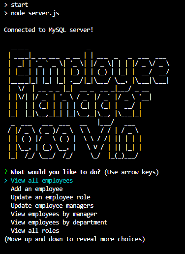

# SQL Employee Tracker

## Description
Create an employee database manager in SQL

## Table of Contents
- [Installation](#installation)
- [Usage](#usage)
- [License](#license)
- [Contributing](#contributing)
- [Testing](#testing)
- [Questions](#questions)

## Installation
Requires mysql2, inquirer, figlet

## Usage
<a href="https://drive.google.com/file/d/1FQMc2dfAprR5j8nZu7sleuR0qBJF_bA_/view">Video demo link</a>

## License  
This application is not covered under a license.

## Contributing
Please use code as you see fit from Github repo

## Testing
NA

## Questions
Please feel free to reach out for any questions:
- GitHub: https://github.com/jako0320
- Email: jacques.scoffoni@gmail.com
